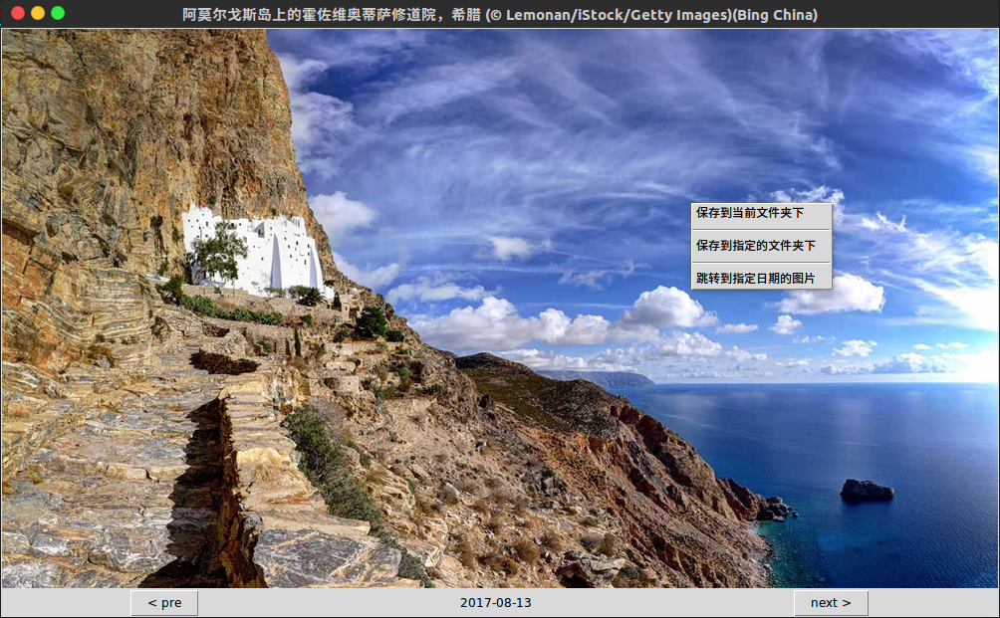

# Bing Wallpaper Viewer
某天刷网页的时候突然看上了`bing`搜索引擎的壁纸,于是想要下载下来.bing很贴心的提供了当日壁纸的下载功能, 然而通过这种方式下载的图片有水印并且只能下载当天的, 于是自己动手写了个bing的壁纸查看器, 可以查看并保存任意一天的壁纸且无水印.

如果你也喜欢bing的壁纸, 它会有用的:)

## 界面
 

## 功能说明

界面下方的两个按钮分别可以查看昨天和明天的壁纸(如果存在的话).界面下方还会显示这是哪一天的壁纸.

界面的标题就是对当前壁纸的描述.在图片区域右键会弹出菜单,分别有以下选项:
- `保存到当前文件夹下`:将当前的图片保存到程序启动的目录下,方便快捷.
- `保存到指定的文件夹下`:将当前的图片保存到用户指定的目录下(点击将会弹出文件对话框)
- `跳转到指定日期的图片`:直接跳转到特定日期(由用户输入)的壁纸.

在图片区域左键将会隐藏菜单.

## 如何使用
### 运行python代码
适用于了解python的人, 需要`python 2.7`并安装`bs4 PIL`,确保依赖安装之后, 直接运行`bing.py`即可, 不依赖平台.

### 运行二进制文件
目前未提供, 待补充.
